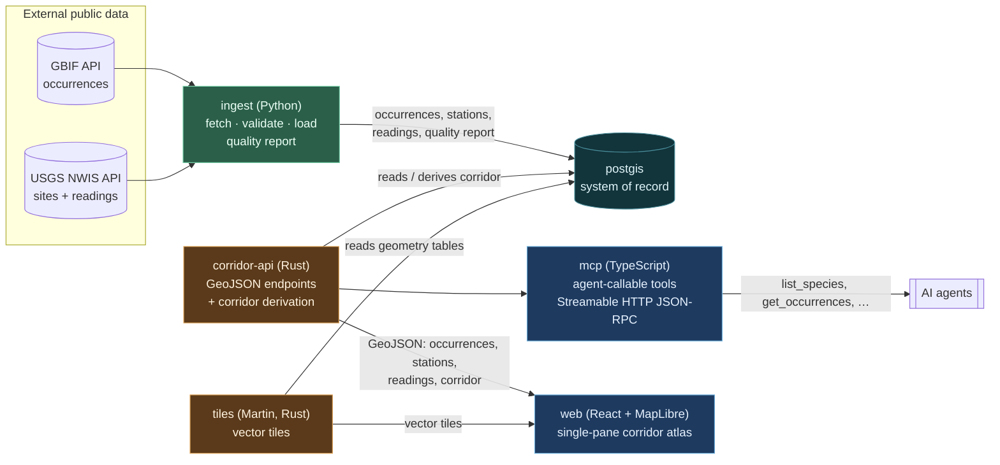

# Sturgeon Run

**An open geospatial platform for seeing the Hudson River estuary the way an
endangered Atlantic sturgeon experiences it.**

Sturgeon Run ingests real public data — [GBIF](https://www.gbif.org/) species
occurrence records and [USGS](https://waterdata.usgs.gov/nwis) water monitoring
feeds — cleans and assesses it, and serves it as an interactive **corridor
atlas**: migration/occurrence corridors layered with water conditions and
habitat context on a single map. It is built to be a living resource a research
group can actually extend — new species, new data layers, new contributors —
and it is honest about data quality and provenance at every step. The audience
is scientists and conservation teams, so nothing here hand-waves: derived
layers are labeled as derived, and every layer carries the counts and the
reasons behind them.

> **Atlantic sturgeon** (*Acipenser oxyrinchus*) is a large, ancient,
> anadromous fish. The Hudson River population is protected under the U.S.
> Endangered Species Act. This project does **not** track individual animals;
> it visualizes where the public record says the species has been observed,
> alongside the river conditions around those places.

---

## Architecture

Six services, orchestrated with Docker Compose for development and mirrored by a
Kubernetes Kustomize base + dev overlay.



**Data flow:** `ingest` pulls real GBIF + USGS data, validates it, and writes it
(plus a machine-readable quality report) into `postgis`. `corridor-api` serves
that data as GeoJSON and derives the corridor density layer. `tiles` (Martin)
serves vector tiles straight from the geometry tables. `web` draws the single
map from the API and tiles. `mcp` exposes the same dataset to AI agents as
callable tools, reading through `corridor-api` rather than the database.

### Why each language, per service

| Service | Language / stack | Why this choice |
|---|---|---|
| **ingest** | Python | Data-wrangling ergonomics: pulling messy real-world API responses, parsing dates/intervals, coordinate validation, and dedup is exactly what Python's ecosystem is built for. Fast to write and read, easy for scientists to extend. |
| **corridor-api** | Rust (axum + sqlx) | Efficiency on the hot path. This is the service every map pan and every agent hits; Rust gives predictable low latency and memory safety for concurrent GeoJSON serving and the corridor derivation query. |
| **tiles** | Martin (Rust) — off-the-shelf | Vector tiles are a solved problem; Martin is a mature, fast PostGIS tile server. We point it at the DB rather than writing (and maintaining) our own tile server. |
| **mcp** | TypeScript (Node) | The MCP + JSON-RPC + zod-schema ecosystem is most mature in TypeScript, and zod gives us tool input schemas that serialize straight to JSON Schema for `tools/list`. |
| **web** | React + TypeScript + Vite + MapLibre GL | MapLibre is the standard open vector-map renderer; React + Vite is a fast, familiar front-end path for contributors. |
| **postgis** | `postgis/postgis` — off-the-shelf | The system of record. PostGIS is the reference spatial database; no reason to build our own. |

---

## Quickstart

### Docker Compose (primary dev path)

```bash
cp .env.example .env
# Optional but recommended: set a token to enable the MCP endpoint
#   MCP_API_TOKEN=dev-please-change   (leave blank to keep MCP disabled)

make up            # build + start postgis, corridor-api, tiles, mcp, web
make ingest        # one-shot: pull real GBIF + USGS data into PostGIS
make derive        # compute the derived corridor (hex-bin) layer
make smoke         # curl every healthcheck + MCP tools/list + one tools/call

# then open the atlas
open http://localhost:5173
```

Ingest is a **manually-run one-shot job** (not part of `up`) and is idempotent —
re-running it will not duplicate rows.

If an upstream API is unreachable, run from a cached snapshot instead of failing
or faking data:

```bash
make ingest-snapshot   # loads data/snapshots/*, marks snapshot_mode in the report
```

### Kubernetes (Kustomize)

Mirrors the compose topology for a dev cluster (e.g. kind/minikube):

```bash
kubectl kustomize k8s/overlays/dev      # render/inspect
kubectl apply -k k8s/overlays/dev       # apply to your cluster
```

The MCP token is a Secret placeholder (`k8s/base`) — populate it before relying
on the MCP endpoint. No secrets are committed.

---

## MCP tools

The `mcp` service is a stateless MCP server over Streamable HTTP JSON-RPC
(`POST /mcp`; methods `initialize`, `tools/list`, `tools/call`, `ping`). It
requires `Authorization: Bearer $MCP_API_TOKEN`; if `MCP_API_TOKEN` is unset the
endpoint is **disabled** (fail-closed). Every tool reads through `corridor-api`,
never the database directly.

| Tool | Arguments | Returns |
|---|---|---|
| `list_species` | — | Tracked species and their GBIF taxon keys |
| `get_occurrences` | `bbox?`, `from?`, `to?`, `species_id?`, `limit?` | Occurrence points (GeoJSON) in range |
| `get_stations` | — | USGS monitoring stations (GeoJSON) |
| `get_latest_readings` | `parameter_cd?` | Latest reading per station/parameter |
| `get_corridor_summary` | `species_id?` | Corridor cell/occurrence counts + extent |
| `get_data_quality_report` | — | The ingest data-quality report (counts kept/dropped, reasons) |

Example:

```bash
curl -s -X POST http://localhost:8081/mcp \
  -H "authorization: Bearer $MCP_API_TOKEN" \
  -H 'content-type: application/json' \
  -d '{"jsonrpc":"2.0","id":1,"method":"tools/list"}'
```

---

## Who this is useful for

- **Researchers.** A fisheries lab studying Hudson sturgeon can pull every
  public occurrence in the estuary, see it against real-time water temperature
  and salinity from USGS gauges, and export the exact GeoJSON behind a figure —
  with the quality report documenting what was dropped and why, so the figure is
  defensible.
- **Conservation nonprofits.** A river-keeper organization can point to the
  corridor atlas in a public comment or grant application to show where
  observations cluster relative to a proposed dredging or construction zone,
  using data whose provenance is transparent rather than a black-box heat map.
- **Educators.** A university GIS or marine-biology course can give students a
  real, running spatial-data stack — live APIs, a spatial database, a tile
  server, a map front end, and an agent interface — to explore, extend, and
  critique, including its honest limitations.

---

## Data & Limitations

**Be skeptical — this section is the point.**

- **What's real.** Occurrence points come from **GBIF** (species occurrence
  records contributed by many datasets). Monitoring stations and water readings
  come from the **USGS National Water Information System** (NWIS)
  instantaneous-values service. Nothing in the pipeline is synthetic. When live
  APIs are unreachable, ingest can load a cached snapshot of a previous real
  fetch (`data/snapshots/`), and the quality report is flagged
  `snapshot_mode: true`. Data is never fabricated.

- **What's derived — read this carefully.** The **corridor layer is a
  statistical artifact of the occurrence data, not tracked animal paths.** It is
  a hex-bin density surface: occurrence points are binned into hexagonal cells
  (edge length `CORRIDOR_HEX_METERS`, computed in UTM 18N) and each cell is
  shaded by how many records fall in it. A dense cell means *many records were
  reported there*, which is a mix of true animal presence **and** observation
  effort (where people sampled, where telemetry projects operated). It is **not**
  a migration route and must not be read as one.

- **Known gaps.**
  - GBIF occurrences carry uneven precision and effort bias; some lack dates
    (kept with a null date rather than discarded) or have large coordinate
    uncertainty. Basis-of-record filtering removes fossil and living-specimen
    records but cannot fix underlying reporting bias.
  - USGS instantaneous values are point-in-time gauge readings; parameter
    coverage varies by station and some stations report only discharge or gage
    height, not water quality.
  - The corridor bbox is fixed to the Hudson estuary (NY Harbor → Troy);
    occurrences outside it are intentionally excluded and counted as dropped.
  - Web Mercator / UTM distortion and the chosen hex size affect the visual
    density; change `CORRIDOR_HEX_METERS` to see the sensitivity.

See `docs/CONTRACTS.md` for exact data shapes, and the ingest **data quality
report** (`data/quality-report.json`, also in the `data_quality_reports` table
and via the `get_data_quality_report` MCP tool) for per-run counts kept/dropped
with reasons.

---

## Attribution

- **GBIF.** Occurrence data accessed via the GBIF API. GBIF asks that use be
  cited; for reproducible research, generate a GBIF download DOI and cite it.
  Per-dataset attribution is preserved in each occurrence's `dataset_key`.
  See <https://www.gbif.org/citation-guidelines>.
- **USGS.** Water data courtesy of the U.S. Geological Survey, National Water
  Information System (NWIS). U.S. Geological Survey data are in the public
  domain; credit the USGS. See <https://waterdata.usgs.gov/>.

## Project layout

```
db/init/         PostGIS schema (extensions, tables, indexes)
ingest/          Python fetch + validate + load + quality report
corridor-api/    Rust axum+sqlx GeoJSON API + corridor derivation
tiles/           Martin vector tile server config
mcp/             TypeScript MCP server (agent tools)
web/             React + Vite + MapLibre front end
k8s/             Kustomize base + dev overlay
docs/CONTRACTS.md  cross-service shapes (source of truth)
scripts/smoke.sh   end-to-end smoke check
```

## License

MIT — see [LICENSE](LICENSE). Contributions welcome; see
[CONTRIBUTING.md](CONTRIBUTING.md).
